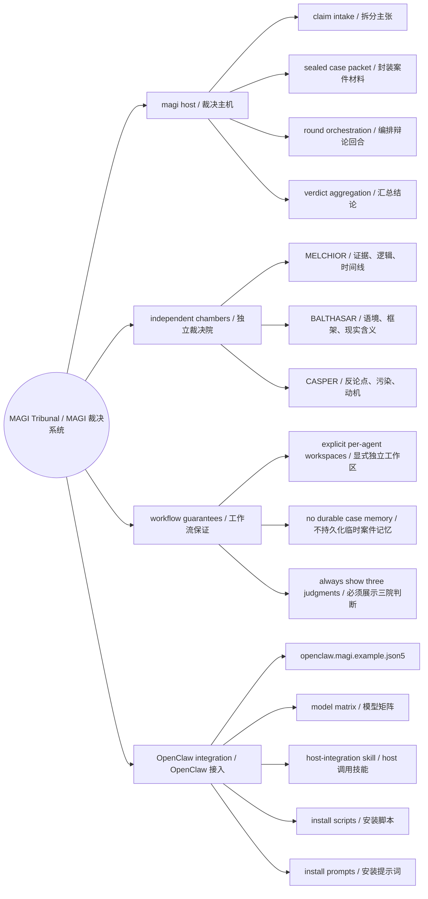
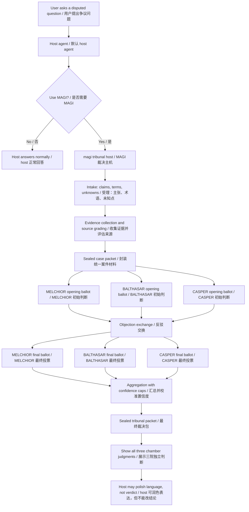
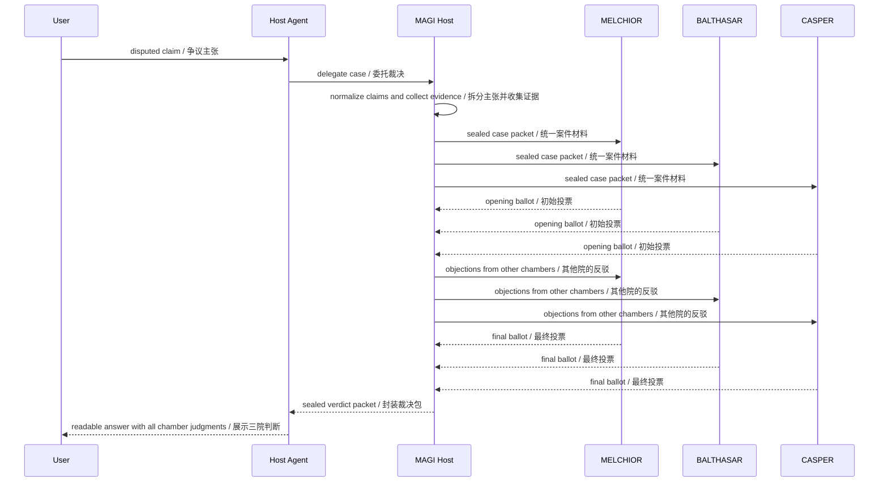

# OpenClaw MAGI Tribunal

A four-agent adjudication workflow for OpenClaw.

一套给 OpenClaw 使用的四 agent 裁决工作流。

MAGI Tribunal is meant for moments when a normal answer is too smooth: disputed claims, messy evidence, internet-dependent facts, and questions where the useful answer needs both proof and pushback.

MAGI Tribunal 适合那些“普通回答太顺滑”的问题：争议说法、证据混乱、依赖互联网查证的事实，以及需要同时给出证据和反驳的问题。

The project is small on purpose. It does not try to become your main persona. It gives your existing agent a clean, reusable tribunal layer.

这个项目有意保持克制。它不试图取代你的默认人格，只给现有 agent 增加一层可复用、边界清楚的裁决系统。

---

## What It Is / 这是什么

MAGI Tribunal splits judgment into one host and three independent chambers:

MAGI Tribunal 把一次判断拆成一个主机和三个相互独立的裁决院：

- `magi`: the tribunal host. It prepares the case packet, coordinates rounds, aggregates ballots, and returns the final sealed result.
- `magi`：裁决主机。负责整理案件、分发材料、编排回合、汇总投票，并输出最终裁决包。
- `magi-melchior`: the evidence and logic chamber.
- `magi-melchior`：证据与逻辑院。
- `magi-balthasar`: the context and interpretation chamber.
- `magi-balthasar`：语境与解释院。
- `magi-casper`: the adversarial challenge chamber.
- `magi-casper`：对抗与污染院。

The three chambers have separate workspaces and separate instructions. The host is not allowed to roleplay them inside one monologue.

三个裁决院拥有独立 workspace 和独立指令。主机不能在一个内部独白里假装三院同时存在。

---

## System Map / 系统思维导图



---

## Workflow / 工作流



---

## Debate Protocol / 辩论协议



---

## Why Four Agents / 为什么要拆成四个 agent

OpenClaw supports per-agent workspaces and per-agent skill visibility. This package leans on that instead of asking one agent to pretend to be three independent judges.

OpenClaw 支持按 agent 划分 workspace 和技能可见性。本项目利用这个机制，而不是让一个 agent 在同一段上下文里扮演三个“独立判断者”。

This matters for three reasons:

这件事重要，原因有三点：

- Isolation: each chamber reads its own `AGENTS.md`, `SOUL.md`, `TOOLS.md`, `IDENTITY.md`, and `memory/`.
- 隔离性：每个裁决院读取自己的 `AGENTS.md`、`SOUL.md`、`TOOLS.md`、`IDENTITY.md` 和 `memory/`。
- Debate quality: objections come from different operating briefs, not just different paragraphs.
- 辩论质量：反驳来自不同的职责设定，而不是同一段文字里的风格切换。
- Failure visibility: if a chamber is missing, MAGI reports an incomplete install instead of hiding the problem.
- 失败可见性：如果某个 chamber 缺失，MAGI 会报告安装不完整，而不是把问题藏起来。

The current example config therefore sets explicit `workspace` paths for all four agents and gives `magi` permission to dispatch the three chambers through `subagents.allowAgents`.

因此，当前示例配置会给四个 agent 明确设置 `workspace` 路径，并通过 `subagents.allowAgents` 允许 `magi` 调度三个 chamber。

Reference notes:

参考说明：

- OpenClaw documents per-agent `workspace` and `subagents.allowAgents` under its agent configuration reference.
- OpenClaw 在 agent 配置文档中说明了 per-agent `workspace` 和 `subagents.allowAgents`。
- OpenClaw loads workspace skills from `<workspace>/skills`, and a non-empty `agents.list[].skills` list is the final skill allowlist for that agent.
- OpenClaw 会从 `<workspace>/skills` 加载 workspace 技能；非空的 `agents.list[].skills` 会成为该 agent 的最终技能白名单。

Links:

- [OpenClaw agent configuration](https://documentation.openclaw.ai/gateway/config-agents)
- [OpenClaw skills documentation](https://github.com/openclaw/openclaw/blob/main/docs/tools/skills.md)

---

## Repository Layout / 仓库结构

```text
openclaw-magi-tribunal/
├─ README.md
├─ .gitignore
├─ openclaw.magi.example.json5
├─ configs/
│  └─ magi-models.example.json5
├─ scripts/
│  ├─ install-magi.ps1
│  └─ install-magi.sh
├─ prompts/
│  ├─ install-from-zip.md
│  └─ update-existing-install.md
├─ host-integration/
│  ├─ AGENTS.snippet.md
│  └─ skills/
│     └─ magi-tribunal/
│        └─ SKILL.md
├─ workspace-magi/
├─ workspace-magi-melchior/
├─ workspace-magi-balthasar/
└─ workspace-magi-casper/
```

---

## Installation: Command Line / 安装方式一：命令行

The scripts install the four MAGI workspaces and optionally install the host-facing skill. They also back up existing MAGI folders and `openclaw.json` when present.

脚本会安装四个 MAGI workspace，并可选安装给 host 调用的技能。如果本机已有 MAGI 文件夹或 `openclaw.json`，脚本会先备份。

The scripts do not rewrite your whole OpenClaw config. OpenClaw configs often contain channel tokens, bindings, provider settings, and personal routing. A careful merge is safer.

脚本不会整份重写你的 OpenClaw 配置。OpenClaw 配置里常常有渠道、凭据、绑定和个人路由，手动或由可信 agent 增量合并更稳。

### Windows PowerShell / Windows PowerShell

```powershell
cd D:\path\to\openclaw-magi-tribunal
powershell -ExecutionPolicy Bypass -File .\scripts\install-magi.ps1 -InstallHostSkill
```

Custom paths:

自定义路径：

```powershell
powershell -ExecutionPolicy Bypass -File .\scripts\install-magi.ps1 `
  -OpenClawHome "$env:USERPROFILE\.openclaw" `
  -HostWorkspace "$env:USERPROFILE\.openclaw\workspace" `
  -InstallHostSkill
```

### macOS / Linux

```bash
cd /path/to/openclaw-magi-tribunal
bash scripts/install-magi.sh --install-host-skill
```

Custom paths:

自定义路径：

```bash
OPENCLAW_HOME="$HOME/.openclaw" \
HOST_WORKSPACE="$HOME/.openclaw/workspace" \
bash scripts/install-magi.sh --install-host-skill
```

### Merge Config / 合并配置

After copying files, merge `openclaw.magi.example.json5` into `~/.openclaw/openclaw.json`.

复制文件后，把 `openclaw.magi.example.json5` 合并进 `~/.openclaw/openclaw.json`。

Keep these fields:

请保留这些字段：

- `agents.list[].workspace` for all four MAGI agents.
- 四个 MAGI agent 的 `agents.list[].workspace`。
- `magi.skills: ["magi-tribunal"]`.
- `magi.skills: ["magi-tribunal"]`。
- `magi.subagents.allowAgents` with the three chamber ids.
- `magi.subagents.allowAgents` 中的三个 chamber id。
- `magi.subagents.requireAgentId: true`.
- `magi.subagents.requireAgentId: true`。
- `skills: []` for the three chambers unless you deliberately give them skills later.
- 三个 chamber 保持 `skills: []`，除非你明确想给它们开放技能。

### Model Configuration / 模型配置

Each MAGI agent can use its own model. This is useful when you want the host to use a strong synthesis model, MELCHIOR to use a careful evidence model, BALTHASAR to use a balanced context model, and CASPER to use a strong adversarial reviewer.

四个 MAGI agent 都可以单独指定模型。如果你希望主机用强综合模型，MELCHIOR 用严谨证据模型，BALTHASAR 用均衡语境模型，CASPER 用更强的对抗审查模型，就可以这样配置。

OpenClaw accepts either a direct model string or a primary/fallback object:

OpenClaw 支持两种写法：直接模型字符串，或 primary/fallback 对象：

```json5
model: "provider/model"
```

```json5
model: {
  primary: "provider/model",
  fallbacks: ["provider/model"],
}
```

For a complete editable example, see:

完整可改示例见：

- `configs/magi-models.example.json5`

Minimal per-agent example:

最小 per-agent 示例：

```json5
agents: {
  defaults: {
    models: {
      "openai/gpt-5.5": { alias: "magi-large" },
      "openai/gpt-5.4-mini": { alias: "magi-fast" },
    },
  },
  list: [
    {
      id: "magi",
      model: { primary: "magi-large", fallbacks: ["magi-fast"] },
    },
    {
      id: "magi-melchior",
      model: { primary: "magi-large", fallbacks: ["magi-fast"] },
    },
    {
      id: "magi-balthasar",
      model: { primary: "magi-fast", fallbacks: ["magi-large"] },
    },
    {
      id: "magi-casper",
      model: { primary: "magi-large", fallbacks: ["magi-fast"] },
    },
  ],
}
```

Notes:

说明：

- Use provider/model refs that are already enabled in your OpenClaw setup.
- 请使用你本机 OpenClaw 已启用的 `provider/model`。
- If you use aliases, define them under `agents.defaults.models` first.
- 如果使用别名，先在 `agents.defaults.models` 中定义。
- When merging into an existing `agents.list`, update matching agent ids instead of duplicating them.
- 合并到已有 `agents.list` 时，应更新同名 agent，不要重复创建。
- If you do not set per-agent models, MAGI inherits your normal OpenClaw default model.
- 如果不设置 per-agent model，MAGI 会继承 OpenClaw 默认模型。

If your existing host agent should call MAGI through explicit subagent dispatch, add this to that host agent:

如果你的现有 host agent 要通过显式 subagent 调度 MAGI，请给 host agent 增加：

```json5
subagents: {
  allowAgents: ["magi"],
}
```

If the host already has `subagents.allowAgents`, merge `magi` into the existing list.

如果 host 已经有 `subagents.allowAgents`，把 `magi` 合并进原列表即可。

---

## Installation: Direct Prompt / 安装方式二：直接 prompt

If you want OpenClaw itself to perform the install from a zip, attach the zip and send the prompt in:

如果你希望 OpenClaw 自己从 zip 完成安装，把 zip 附上，然后发送这个文件里的 prompt：

- `prompts/install-from-zip.md`

For updating an older MAGI install, use:

如果是升级旧版 MAGI，使用：

- `prompts/update-existing-install.md`

Short version:

简短版：

```text
Install the attached openclaw-magi-tribunal zip into my local OpenClaw setup.
Back up existing MAGI files first.
Install the four workspaces, merge openclaw.magi.example.json5, keep explicit workspace paths,
keep magi.subagents.allowAgents, optionally merge configs/magi-models.example.json5 after replacing model refs,
install the host skill if my default host should call MAGI,
and verify that final MAGI output shows MELCHIOR, BALTHASAR, and CASPER independently.
```

```text
请把我附上的 openclaw-magi-tribunal zip 安装到本机 OpenClaw。
先备份已有 MAGI 文件。
安装四个 workspace，合并 openclaw.magi.example.json5，保留显式 workspace 路径，
保留 magi.subagents.allowAgents；如需自定义模型，替换模型引用后合并 configs/magi-models.example.json5；
如果我的默认 host 需要调用 MAGI，请安装 host skill；
最后验证 MAGI 输出会独立展示 MELCHIOR、BALTHASAR、CASPER 三院判断。
```

---

## Output Contract / 输出约定

Every MAGI result should include:

每次 MAGI 输出都应包含：

- Overall verdict.
- 总 verdict。
- Overall confidence.
- 总 confidence。
- Claim map.
- 主张拆分。
- Round 1 summary.
- 第一轮摘要。
- Round 2 objections.
- 第二轮反驳。
- Independent chamber judgments from `MELCHIOR`, `BALTHASAR`, and `CASPER`.
- `MELCHIOR`、`BALTHASAR`、`CASPER` 三院独立判断。
- Final chamber ballots.
- 最终投票。
- What could change the verdict.
- 什么证据会改变结论。
- Sources.
- 来源。

The host may make the answer easier to read. It may not change the verdict, inflate confidence, hide uncertainty, or remove chamber judgments.

host 可以把输出写得更清楚，但不能改变 verdict、提高 confidence、隐藏不确定性，也不能删掉三院独立判断。

---

## Verdict Labels / 结论标签

MAGI uses six labels:

MAGI 使用六类结论：

- `SUPPORTED`: strong direct support.
- `SUPPORTED`：有强直接证据支持。
- `LIKELY`: supported, but not airtight.
- `LIKELY`：有支持，但并非完全封闭。
- `DISPUTED`: serious unresolved disagreement.
- `DISPUTED`：存在严重未解决分歧。
- `UNSUPPORTED`: not enough support for the claim.
- `UNSUPPORTED`：证据不足以支持该说法。
- `FALSE`: direct evidence contradicts the claim.
- `FALSE`：直接证据与该说法相矛盾。
- `UNKNOWN`: evidence is too thin, inaccessible, or unstable.
- `UNKNOWN`：证据太少、不可访问，或事实状态不稳定。

Confidence is deliberately simple: `High`, `Medium`, or `Low`.

置信度故意保持简单：`High`、`Medium`、`Low`。

---

## Memory Boundaries / 记忆边界

This repository enforces separation at the workspace level:

本仓库在 workspace 层面做隔离：

- Each chamber has its own files and memory directory.
- 每个 chamber 都有自己的文件和 memory 目录。
- Chambers are instructed not to read or write `memory/` for case notes.
- 三个 chamber 都被要求不要把案件笔记写入 `memory/`。
- MAGI starts every tribunal from a fresh case packet.
- MAGI 每次裁决都从新的案件材料开始。
- Temporary case notes should be cleaned after the verdict.
- 临时案件笔记应在裁决后清理。

There is one honest limit: transcript-level cleanup depends on the OpenClaw runtime. If your runtime provides fresh session, reset, forget, or cleanup controls, enable them for chamber sessions.

这里有一个需要讲清楚的限制：转录记录级别的清理取决于 OpenClaw 运行时。如果你的运行时支持 fresh session、reset、forget 或 cleanup，应给 chamber 会话启用。

---

## Common Failure Modes / 常见问题

`All chambers seem to share context`

`三个 chamber 看起来共享上下文`

Check that every MAGI agent has an explicit `workspace` path in `openclaw.json`.

检查 `openclaw.json` 中四个 MAGI agent 是否都写了显式 `workspace`。

`The host cannot call MAGI`

`host 无法调用 MAGI`

If dispatch uses explicit subagents, add `magi` to the host agent's `subagents.allowAgents`.

如果调度使用显式 subagent，把 `magi` 加入 host agent 的 `subagents.allowAgents`。

`A model alias is not recognized`

`模型别名无法识别`

Make sure the alias is defined under `agents.defaults.models`, or use the full `provider/model` value directly in the agent's `model` field.

确认别名已经定义在 `agents.defaults.models` 中，或者直接在 agent 的 `model` 字段里使用完整 `provider/model`。

`MAGI cannot call the chambers`

`MAGI 无法调用三个 chamber`

Keep `magi.subagents.allowAgents` with `magi-melchior`, `magi-balthasar`, and `magi-casper`.

保留 `magi.subagents.allowAgents`，其中应包含 `magi-melchior`、`magi-balthasar` 和 `magi-casper`。

`The magi-tribunal skill is not visible`

`看不到 magi-tribunal 技能`

Workspace skills should live at `<workspace>/skills/<skill-name>/SKILL.md`. For the MAGI host, that means `~/.openclaw/workspace-magi/skills/magi-tribunal/SKILL.md`.

workspace 技能应位于 `<workspace>/skills/<skill-name>/SKILL.md`。对 MAGI host 来说，就是 `~/.openclaw/workspace-magi/skills/magi-tribunal/SKILL.md`。

`Final answer only shows one verdict`

`最终输出只显示一个总判断`

The host integration is incomplete. Install the host skill and merge the routing snippet. MAGI's packet must expose the three independent chamber judgments.

这通常说明 host 接入不完整。请安装 host skill 并合并路由片段。MAGI 裁决包必须展示三院独立判断。

---

